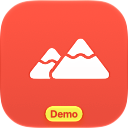

# Device Hub Sample Project

 Altitude Recovery is a small SwiftUI app built for demonstrating Device Hub and `devicectl` workflows.

If you want to support my work, you can -  

## Altitude Recovery

The project also includes an **AltitudeRecovery Watch App** target. The iPhone app sends an app snapshot through WatchConnectivity containing both its current workout list and its location-derived recovery advice. The Watch caches the latest snapshot. From the recovery summary, you can see the same detected place and altitude, then open the synchronized workouts and drill into duration, distance, elevation gain, and date details.

